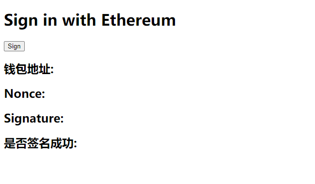
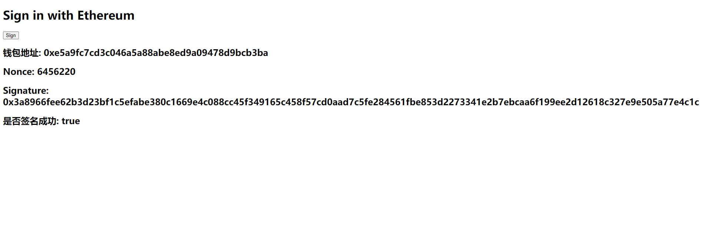

# Ethers极简入门 工具篇: ET02. 实现MetaMask签名授权登录功能

我最近在重新学`ethers.js`，巩固一下细节，也写一个`WTF Ethers极简入门`，供小白们使用。

**推特**：[@0xAA_Science](https://twitter.com/0xAA_Science)

**WTF Academy社群：** [官网 wtf.academy](https://wtf.academy) | [WTF Solidity教程](https://github.com/AmazingAng/WTFSolidity)
| [discord](https://discord.gg/5akcruXrsk)
| [微信群申请](https://docs.google.com/forms/d/e/1FAIpQLSe4KGT8Sh6sJ7hedQRuIYirOoZK_85miz3dw7vA1-YjodgJ-A/viewform?usp=sf_link)

所有代码和教程开源在github: [github.com/WTFAcademy/WTFEthers](https://github.com/WTFAcademy/WTFEthers)

-----

这一讲，我们将介绍如何通过 `ethers.js` 在网页上连接小狐狸钱包，实现MetaMask签名授权后完成登录功能

## Metamask

Metamask（小狐狸）钱包是以太坊最受欢迎的开源钱包，它可以作为PC端的浏览器插件或移动端（安卓和苹果）的APP使用。

在使用Metamask开发前，你需要先下载它。记住：

**一定要在官网上下载: https://metamask.io/download/**

**一定要在官网上下载: https://metamask.io/download/**

**一定要在官网上下载: https://metamask.io/download/**

重要的事情说三遍。很多多用户钱包被盗，就是下载了盗版的小狐狸钱包之后输入了助记词/私钥。

## 连接metamask

在安装好metamask钱包后，浏览器会给每个页面注入一个`window.ethereum`对象，用于和钱包交互。`ethers.js`提供的 `Web3Provider` 封装了一个标准的 Web3
Provider，直接在程序中生成一个provider对象，方便使用：

```js
// 获得provider
const provider = new ethers.providers.Web3Provider(window.ethereum)
```

之后就像 `ethers.js` 中的 `provider` 一样使用就好，下面举几个例子。

首先，我们先写一个简单的HTML页面，因为小狐狸钱包是浏览器插件，必须在浏览器中使用。

```html
<!DOCTYPE html>
<html lang="en">
<head>
    <meta charset="UTF-8">
    <meta name="viewport" content="width=device-width, initial-scale=1.0">
</head>
<body>
   <h1 id="header">Sign in with Ethereum</h1>
   <button class="sign">Sign</button>
   <h2>钱包地址: <span class="showAccount"></span></h2>
   <h2>Nonce: <span class="showNonce"></span></h2>
   <h2>Signature: <span class="showSignature"></span></h2>
   <h2>是否签名成功: <span class="showSignStatus"></span></h2>
</body>
</html>
```



然后我们写一些`javascript`脚本嵌入进去。

1. 引入 `ethers.js` 包，获取页面中的按钮和文本变量，给按钮加一个监听器，被点击时会触发 `onClickHandler()` 函数。

    ```js
    import {ethers} from "https://cdn-cors.ethers.io/lib/ethers-5.6.9.esm.min.js";
    const signButton = document.querySelector('.sign');
    const showAccount = document.querySelector('.showAccount');
    const showNonce = document.querySelector('.showNonce');
    const showSignature = document.querySelector('.showSignature');
    const showSignStatus = document.querySelector('.showSignStatus');

    signButton.addEventListener(`click`, onClickHandler)
    ```
2. 接下来我们创建一个变量模拟后台数据库，保存着用户的信息
   ```js
    //假设这是后台的数据库，users表里保存了user对象，user对象包含用户的地址和关联的nonce
    //{"address": 用户地址, "nonce": 返回给前端的随机数nonce}
    export const users = {}
    ```
3. 写模拟后台接口的方法：通过地址获取后端生成的随机数 nonce，用于签名
    ```js
    /**
     * 通过地址获取后端生成的随机数 nonce，用于签名
     * @param address  用户地址
     * @returns {number} 返回随机数 nonce
     *
     * 这个方法充当后台服务，从后台中获取需要签名的数据
     */
    function auth(address) {
        let user = users[address]
        if (!user) {
            user = {
                address,
                nonce: Math.floor(Math.random() * 10000000)
            }
            users[address] = user
        } else {
            const nonce = Math.floor(Math.random() * 10000000)
            user.nonce = nonce
            users[address] = user
        }
        return user.nonce
    }
    ```
4. 写模拟后台接口的方法：验证用户签名是否正确
    ```js
    /**
     * 验证用户签名是否正确
     * @param address   用户地址
     * @param signature 签名数据
     * @returns {boolean} 返回签名是否正确
     *
     * 这个方法充当后台服务，后台验证签名正确后，就返回相关登录态数据，完成登录流程
     */
    function verify(address, signature) {
        let signValid = false
        console.log(`address: ${address}`)
        //从数据库中取出nonce
        let nonce = users[address].nonce
        console.log(`nonce: ${nonce}`)
        //验证对nonce进行签名的地址
        const decodedAddress = ethers.utils.verifyMessage(nonce.toString(), signature.toString())
        console.log(`decodedAddress: ${decodedAddress}`)
        //比较地址和签名的地址是否一致
        if (address.toLowerCase() === decodedAddress.toLowerCase()) {
            signValid = true
            //出于安全原因，更改nonce，防止下次直接使用相同的nonce进行登录
            users[address].nonce = Math.floor(Math.random() * 10000000)
        }
        return signValid
    }
    ```
   
5. 我们写`onClickHandler()` 函数的内容，首先连接metamask，创建`provider`变量，获取后端需要签名的接口数据，拿到数据后进行签名，再次请求后端验证签名是否正确

    ```js
    // 前端签名流程
    async function onClickHandler() {
        console.log("连接钱包")
        // 获得provider
        const provider = new ethers.providers.Web3Provider(window.ethereum)
        // 读取钱包地址
        const accounts = await provider.send("eth_requestAccounts", []);
        const account = accounts[0]
        console.log(`钱包地址: ${account}`)
        showAccount.innerHTML = account;

        //从后台获取需要进行签名的数据
        const nonce = auth(account);
        showNonce.innerHTML = nonce;
        console.log(`获取后台需要签名的数据: ${nonce}`)
        //签名
        const signer = provider.getSigner()
        const signature = await signer.signMessage(nonce.toString())
        showSignature.innerHTML = signature;
        //去后台验证签名，完成登录
        const signStatus = verify(account, signature);
        showSignStatus.innerHTML = signStatus;
    }
    `````

6. 在本地运行时，你需要安装`http-server`包，你可以用下面这个命令通过 `npm` 它。
    ```shell
    npm install --global http-server
    ```
   然后切换到相应的文件夹，输入下面命令来运行这个网页。注意，直接点击`.html`文件是不能运行的。
    ```shell
    http-server .
    ```
   如果你看到下面的输出，说明运行成功，打开下面给出的网址就可以打开网页了。
    ```shell
    Starting up http-server, serving .
    Available on:
        http://127.0.0.1:8080
        http://10.6.8.162:8080
    ```
   打开当前教程页面
   ```shell
    Starting up http-server, serving .
    Available on:
        http://127.0.0.1:8080/ET02_SignInWithEthereum/index.html
        http://10.6.8.162:8080/ET02_SignInWithEthereum/index.html
    ```




## 在项目中的运用

**最大的用处就是通过这种登录方式让 以太坊地址(EVM)用户 登录到 中心化平台**

**如何使用Metamask进行一键式登录流程**

一键式登录流程的基本思想是，通过使用私钥对一段数据进行签名，可以很容易地通过加密方式证明帐户的所有权。如果您设法签署由我们的后端生成的精确数据，那么后端将认为您是该钱包地址的所有者。因此，我们可以构建基于消息签名的身份验证机制，并将用户的钱包地址作为其标识符。

**在项目设计中，整个登录流程如何工作**
- 第1步：后台用户数据表（后端）：后端保存`address` 和 address对应的`nonce`
- 第2步：生成随机数（后端）：对于数据库中的每个`address`，在 nonce 字段中生成随机字符串
- 第3步：用户获取他们的随机数（前端）：通过后端接口拿到`address`的nonce
- 第4步：用户签署Nonce（前端）：对nonce进行签名
- 第5步：签名验证（后端）：根据请求消息体中 address 获取数据库中的对应用户，特别是它相关的随机数 nonce ，然后对签名进行校验，检验成功证明了拥有钱包地址的所有权，然后可以将JWT或会话标识符返回到前端，完成登录
- 第6步：更改Nonce（后端）：修改nonce，防止用户相同的nonce和签名再次进行登录（防止泄露）

PS：这里的nonce可以是一个需要签名的字符串，不是说一定是随机数也可以是类似这样的；很多项目sign都不是单独的一个nonce，通常会带上一些其他内容

类似这样
```
Sign up with Ethereum to the app.

URI: https://app.xxxx.com
Version: 1
Chain ID: 1
Nonce: 6971359
Issued At: 2023-02-16T06:03:49.534Z
```

## ethers.utils.verifyMessage(nonce, signature) 在后端的实现
Java 后端项目
maven导入web3j
```
<dependency>
   <groupId>org.web3j</groupId>
   <artifactId>core</artifactId>
   <version>4.5.16</version>
</dependency>
```
Java main方法示例代码
```java
import org.web3j.crypto.ECDSASignature;
import org.web3j.crypto.Hash;
import org.web3j.crypto.Keys;
import org.web3j.crypto.Sign;
import org.web3j.utils.Numeric;

import java.math.BigInteger;
import java.nio.charset.StandardCharsets;
import java.util.Arrays;

public class SignInWithEthereum {
   public static void main(String[] args) {
      String address = "0x4adbe2009cff6a1e9d280d28815c49e91b8ebad0";
      String nonce = "3618473";
      String signature = "0x9a38fb504315869609ef2e948b1a80f670e6ff725d16b5ae443b118eb2d108bc3c659c2417d96bbff240b44d4f1078fde73b72f83cc71e4e726640bc19a9c2a91c";
      String MESSAGE_PREFIX = "\u0019Ethereum Signed Message:\n";
      try {
         String digest = Hash.sha3(
                 Numeric.toHexStringNoPrefix(
                         (MESSAGE_PREFIX + nonce.length() + nonce).getBytes(StandardCharsets.UTF_8)));

         byte[] signatureBytes = Numeric.hexStringToByteArray(signature);
         byte v = signatureBytes[64];
         if (v < 27) {
            v += 27;
         }
         byte[] r = (byte[]) Arrays.copyOfRange(signatureBytes, 0, 32);
         byte[] s = (byte[]) Arrays.copyOfRange(signatureBytes, 32, 64);

         Sign.SignatureData signatureData = new Sign.SignatureData(v, r, s);
         int header = 0;
         for (byte b : signatureData.getV()) {
            header = (header << 8) + (b & 0xFF);
         }
         if (header < 27 || header > 34) {
            System.out.println("false");
         }
         int recId = header - 27;
         BigInteger key = Sign.recoverFromSignature(
                 recId,
                 new ECDSASignature(
                         new BigInteger(1, signatureData.getR()), new BigInteger(1, signatureData.getS())),
                 Numeric.hexStringToByteArray(digest));
         if (key == null) {
            System.out.println("false");
         }
         String signAddress = ("0x" + Keys.getAddress(key)).trim();
         System.out.println("signAddress:" + signAddress);
         if (address.toLowerCase().equals(signAddress.toLowerCase())) {
            System.out.println("true");
         }
      } catch (Exception e) {
         System.out.println("false");
      }
   }
}
```
Java 封装的工具类
```Java
import java.math.BigInteger;
import java.nio.charset.StandardCharsets;
import java.util.Arrays;

import org.web3j.crypto.ECDSASignature;
import org.web3j.crypto.Hash;
import org.web3j.crypto.Keys;
import org.web3j.crypto.Sign;
import org.web3j.crypto.Sign.SignatureData;
import org.web3j.utils.Numeric;

public class EthersUtils {
  private static final String MESSAGE_PREFIX = "\u0019Ethereum Signed Message:\n";

  public static String verifyMessage(String message, String signature) {
    return EthersUtils.recoverAddress(EthersUtils.hashMessage(message), signature);
  }

  public static String hashMessage(String message) {
    return Hash.sha3(
        Numeric.toHexStringNoPrefix(
            (EthersUtils.MESSAGE_PREFIX + message.length() + message).getBytes(StandardCharsets.UTF_8)));
  }

  public static String recoverAddress(String digest, String signature) {
    SignatureData signatureData = EthersUtils.getSignatureData(signature);
    int header = 0;
    for (byte b : signatureData.getV()) {
      header = (header << 8) + (b & 0xFF);
    }
    if (header < 27 || header > 34) {
      return null;
    }
    int recId = header - 27;
    BigInteger key = Sign.recoverFromSignature(
        recId,
        new ECDSASignature(
            new BigInteger(1, signatureData.getR()), new BigInteger(1, signatureData.getS())),
        Numeric.hexStringToByteArray(digest));
    if (key == null) {
      return null;
    }
    return ("0x" + Keys.getAddress(key)).trim();
  }

  private static SignatureData getSignatureData(String signature) {
    byte[] signatureBytes = Numeric.hexStringToByteArray(signature);
    byte v = signatureBytes[64];
    if (v < 27) {
      v += 27;
    }
    byte[] r = (byte[]) Arrays.copyOfRange(signatureBytes, 0, 32);
    byte[] s = (byte[]) Arrays.copyOfRange(signatureBytes, 32, 64);
    return new SignatureData(v, r, s);
  }
}
```


## 总结

这一讲，我们介绍如何通过 `ethers.js` 在网页上连接小狐狸钱包，实现MetaMask签名授权后完成登录功能，用户一个钱包地址完成一个登录中心化网站的登录流程
